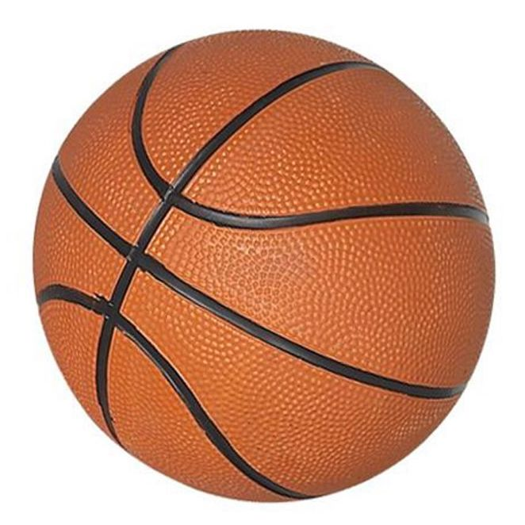
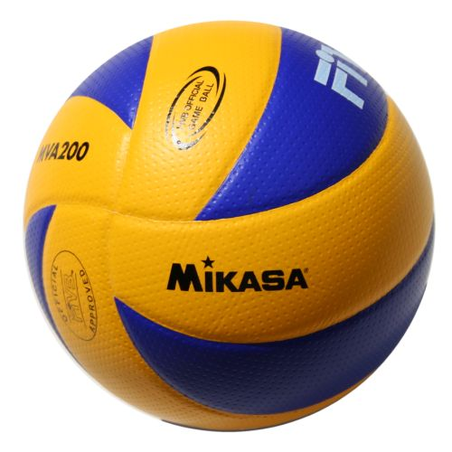

# Hybrid image generator
Python script which produces a hybrid image when given two images as inputs. The idea is that when viewed close-up, the image should look more similar to the first, but further away, more similar to the second. Produced image can be tuned by setting sigma value and image paths at the bottom of the code below the function definitions.

## System requirements
To run this program locally you need:

- Python 3
- A few minutes to wait for the script to run...

### Setup venv
Create a virtual environment using command:
```shell
python3 -m venv venv
```

Activate the venv:

```shell
source venv/bin/activate
```

[More information about venvs](https://docs.python.org/3/library/venv.html)

### Install dependencies
This program uses the opencv and numpy libraries. Install using command:

```shell
pip install -r requirements.txt
```

### Run program
```shell
python hybrid_image_creator.py
```

Once processing is complete, the first hybrid image will appear in a separate window. To view the second hybrid image, click on the image and then press any key. Once viewing is complete, click on the image and press any key again to exit the program.

## Example
Take the following two images which can be found in the `source-images/` directory:

 

Here is an example of a hybrid image at different distances:


## Disclaimer
This is code from some coursework I completed at university - I have added instructions, requirements.txt, .gitignore etc. recently to make it accessible, but the content remains untouched at present.
